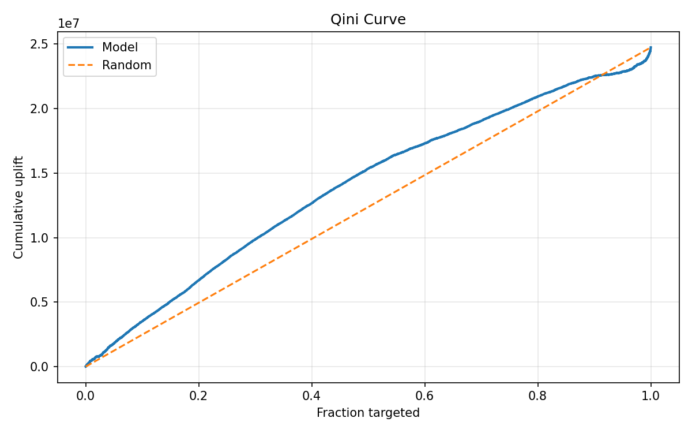
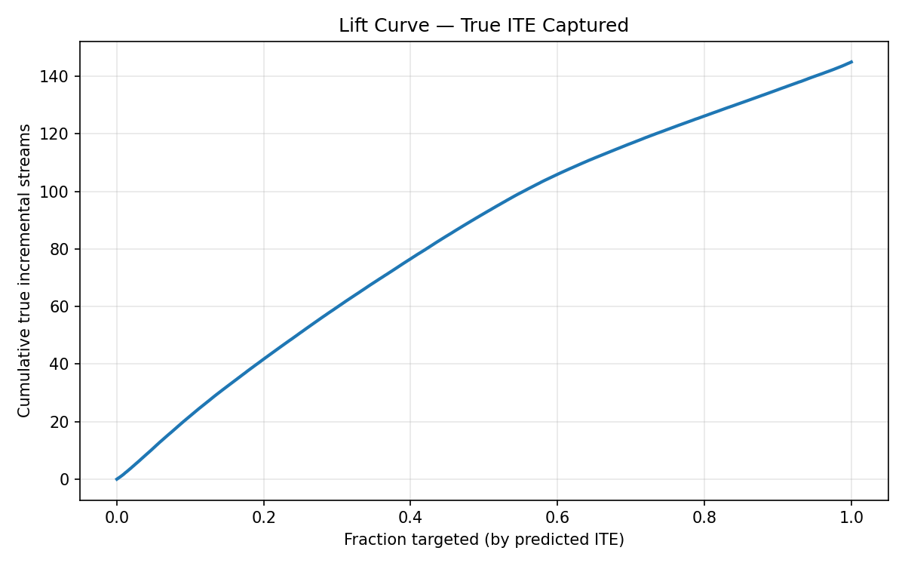
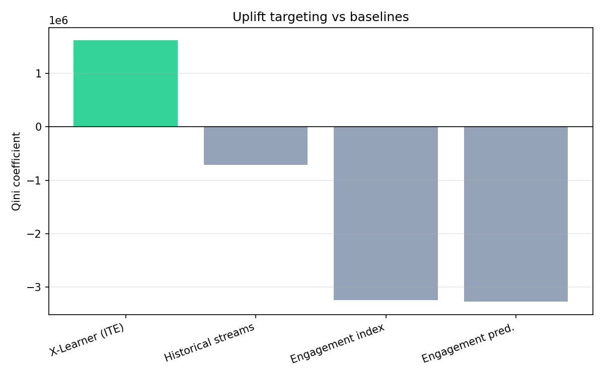
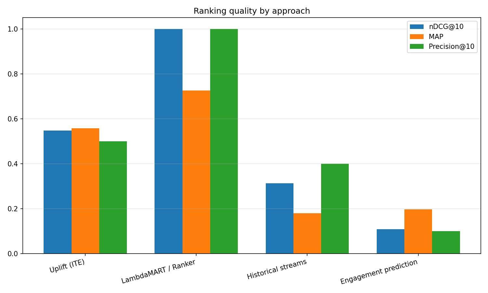
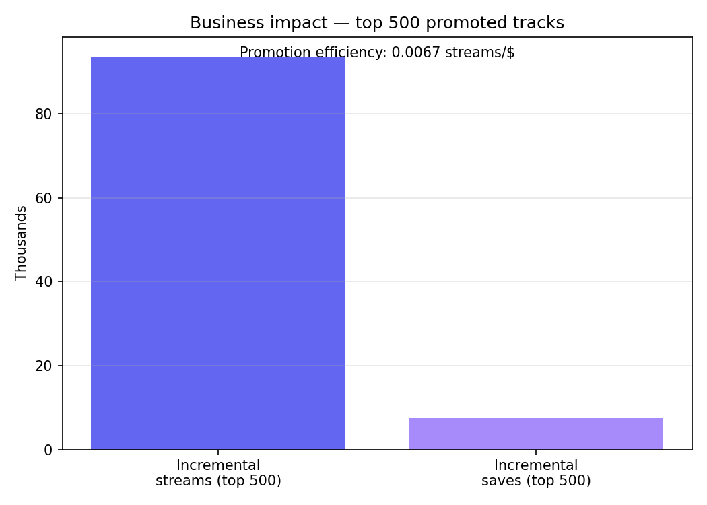
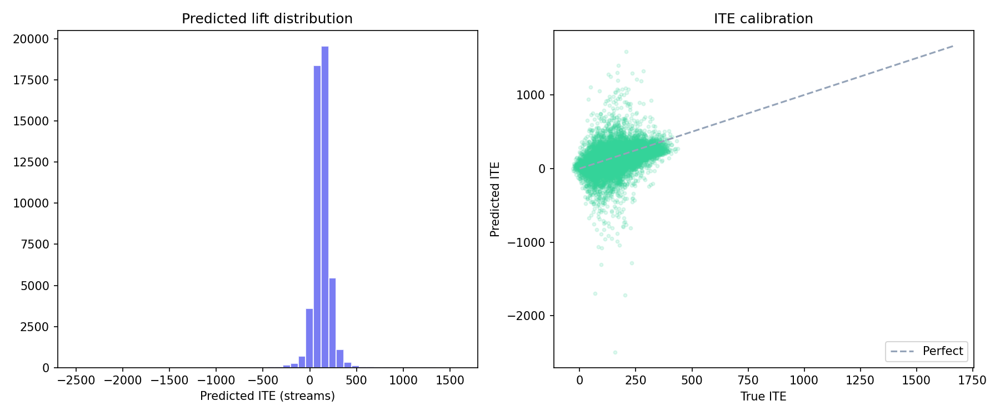
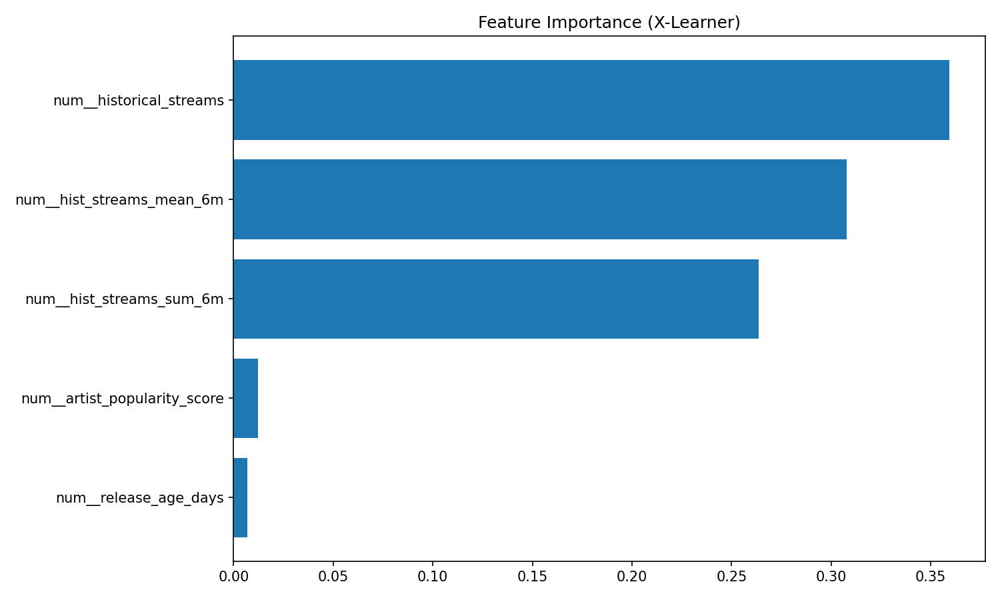

# Music Promotional Uplift & Ranking

Production-style causal ML system that estimates **incremental engagement** from promotional campaigns and ranks tracks by expected promotional ROI.

**Primary system:** [`music_uplift_ranking/`](music_uplift_ranking/) — 50k tracks, 6-month history, Beam ETL, BigQuery feature store, T/S/X uplift models, LambdaMART ranking.

**Legacy API package:** [`src/music_uplift/`](src/music_uplift/) — FastAPI scoring service with X-Learner.

---

## What we estimate

| Quantity | Meaning |
|----------|---------|
| **μ₁(x)** | Expected engagement if promoted |
| **μ₀(x)** | Expected engagement if not promoted |
| **τ(x) / ITE** | Incremental lift = μ₁ − μ₀ |

Tracks are ranked by predicted lift so promotion budget goes to catalog items with the highest **incremental** return—not just high baseline streams.

---

## Quick start

```bash
cd music-promotion
python -m venv .venv && source .venv/bin/activate
pip install -e ".[ranking,dev]"

# Full pipeline (50k tracks, ~10 min)
python music_uplift_ranking/pipelines/run_all.py

# Regenerate README charts from saved results
python scripts/generate_readme_plots.py
```

Open the interactive dashboard: `artifacts/dashboards/ranking_dashboard.html`

---

## Results (50,000-track run)

Dataset: **50,000 tracks**, **6 months** monthly engagement history (300k rows), ~25% promotion rate with **confounded** assignment.

### Uplift targeting

| Metric | Value |
|--------|-------|
| Qini coefficient | 1,611,257 |
| ITE MAE (streams) | 54.3 |
| AUUC | 1,611,257 |







### Ranking quality (nDCG@10, MAP, Precision@10)

| Approach | nDCG@10 | MAP | P@10 |
|----------|---------|-----|------|
| **Ranking model (2nd stage)** | **1.00** | **0.73** | **1.00** |
| Uplift / ITE | 0.55 | 0.56 | 0.50 |
| Historical streams (baseline) | 0.31 | 0.18 | 0.40 |
| Engagement prediction (baseline) | 0.11 | 0.20 | 0.10 |



*Ranking model trained with simulation ground-truth ITE as relevance; in production use delayed observed lift.*

### Business impact (top 500 promotion slots)

| Metric | Value |
|--------|-------|
| Incremental streams (true ITE sum) | **93,668** |
| Incremental saves | **7,493** |
| Promotion efficiency | 0.0067 streams/$ |



### ITE calibration & drivers





| Feature | Importance |
|---------|------------|
| Historical streams | 0.36 |
| 6m mean streams | 0.31 |
| 6m sum streams | 0.26 |
| Artist popularity | 0.01 |

---

## Architecture

```
music-promotion/
├── music_uplift_ranking/       # Main pipeline (see music_uplift_ranking/README.md)
│   ├── data_generation/        # 50k synthetic campaigns + 6mo history
│   ├── beam_pipeline/          # Apache Beam feature ETL
│   ├── feature_store/          # track | promotion | engagement tables
│   ├── uplift_models/          # T-Learner, S-Learner, X-Learner
│   ├── ranking_models/         # LambdaMART, XGBoost Ranker
│   └── evaluation/             # Qini, nDCG, MAP, business metrics
├── docs/images/                # Result plots (for README)
├── src/music_uplift/           # Legacy FastAPI + CLI
└── artifacts/                  # Models, predictions, dashboards (gitignored)
```

### Uplift meta-learners

- **T-Learner** — separate outcome models per arm
- **S-Learner** — single model with treatment flag
- **X-Learner** (primary) — pseudo-effect imputation + propensity weighting

### Second-stage ranking

Combines **predicted uplift**, track quality, historical engagement, and artist popularity via learning-to-rank (LambdaMART / XGBoost Ranker).

---

## Legacy API (`music-uplift` CLI)

```bash
pip install -e ".[dev]"
music-uplift generate
music-uplift train
music-uplift serve   # POST /score, POST /rank
```

See [config/default.yaml](config/default.yaml) for the original slimmer feature set.

---

## Tests

```bash
pytest -q
```

---

## License

MIT (add your license as needed).
